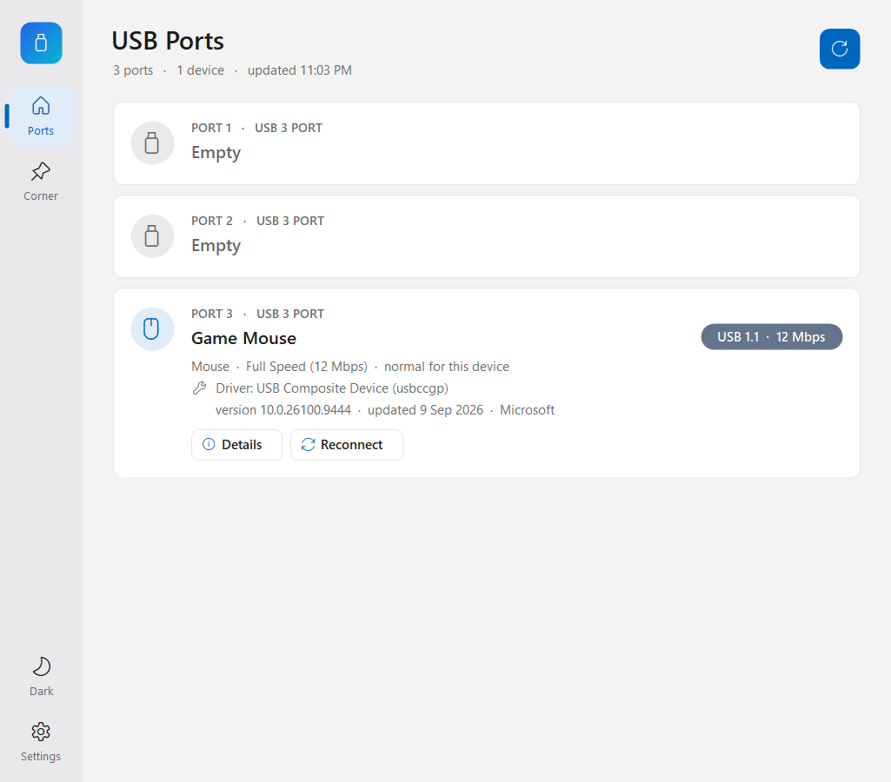
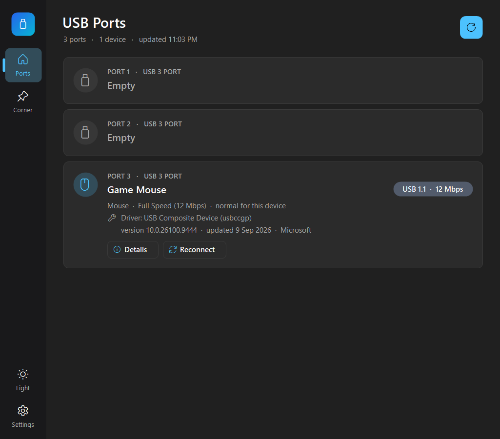
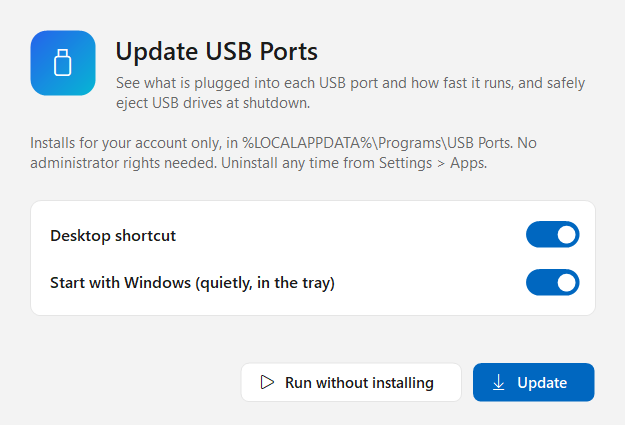
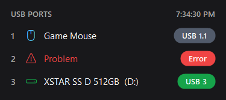
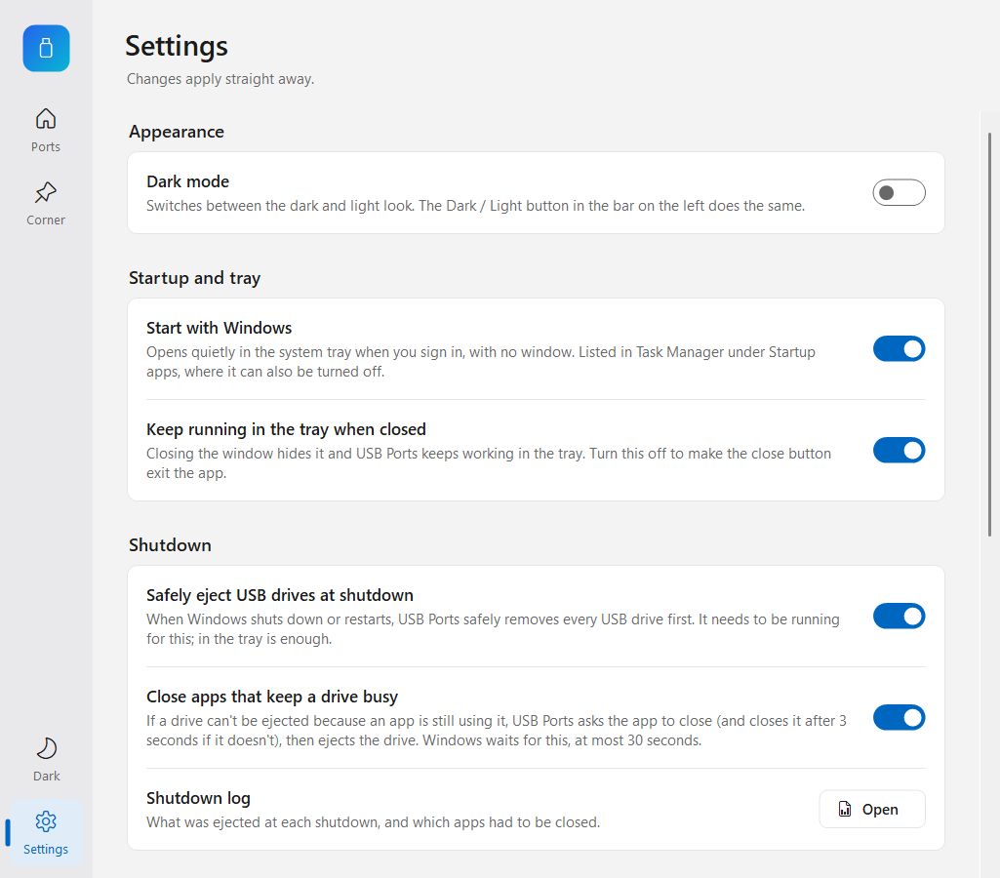

<p align="center">
  
</p>

<h1 align="center">USB Ports</h1>

<p align="center">
  See what's plugged into each USB port of your Windows PC, how fast it's really running,<br>
  and have your USB drives safely ejected every time you shut down.
</p>

<p align="center">
  <a href="https://github.com/firasj082/USB-Ports/raw/main/download/USB-Ports-Setup.exe">
    
  </a>
</p>

<p align="center">
  
  
</p>

## Install

1. **[Download USB-Ports-Setup.exe](https://github.com/firasj082/USB-Ports/raw/main/download/USB-Ports-Setup.exe)** (about 150 KB).
2. Open it. Windows may say **"Windows protected your PC"** because the app isn't code-signed. Click **More info → Run anyway**.
3. Choose **Install**, or **Run without installing** to try it first.



Installing takes a second and needs no administrator rights. It installs for your account only, in `%LOCALAPPDATA%\Programs\USB Ports`, adds a Start menu shortcut (and optionally a Desktop shortcut), and can start with Windows quietly in the system tray. Opening a newer `USB-Ports-Setup.exe` later offers **Update**.

**Uninstall:** Windows **Settings → Apps → Installed apps → USB Ports → Uninstall**. This removes the app, its shortcuts, its startup entries and its settings.

**Requirements:** Windows 10 or 11. It uses the .NET Framework that is already part of Windows, so there's nothing else to install.

## Using it

The bar on the left switches between the **Ports** page and **Settings**, opens **Corner mode**, and flips between dark and light. Closing the window keeps USB Ports running in the system tray: click the tray icon to open it again, or right-click it for Corner mode, Settings and Exit.

## What it shows

One card per physical USB port on your PC. The two internal halves of each USB 3 port are combined, using the pairing your PC's firmware reports.

- **What's plugged in:** the device's name and type. It recognises mice, keyboards, drives, phones, webcams, headsets, microphones, speakers, Wi-Fi and Ethernet adapters, Bluetooth, printers, card readers, security keys, fingerprint readers, drawing tablets, game controllers, DVD drives, UPSs, hubs and more.
- **The real speed:** USB 1.1, USB 2 or USB 3, with the link rate (12 Mbps, 480 Mbps, 5 Gbps, 10 Gbps). A device that **supports USB 3 but connected at USB 2** is flagged in amber, with a hint to reconnect it firmly.
- **Drives:** drive letter, name and free space.
- **Driver:** name, version and when Windows last updated it.
- **Hubs:** everything plugged into a hub, listed under its port.
- **Problems:** a device that failed to start, a power surge, and similar, shown in red.

**Details** opens everything that can be read about a device: maker, IDs, serial number, USB version, power draw versus what the port can supply, its USB interfaces, driver files, and for drives the model, firmware, capacity, sector size, TRIM support and USB protocol (UAS or the older bulk-only).

## Corner mode

A small see-through panel that stays on top in a corner of the screen and updates every 2 seconds. Drag it anywhere, and double-click it to open the full window.



## Safety features

- **Safely ejects USB drives at shutdown and restart.** This matters most with Windows' Fast Startup, where "shut down" can leave external drives marked in use. If an app is still using a drive, USB Ports holds the shutdown for a moment (at most 30 seconds, with Windows' usual **Shut down anyway** button), asks that app to close, closes it if it doesn't, and then ejects the drive. It runs from the tray; the next time you open the app it tells you what was ejected and which apps it had to close, and a shutdown log is kept.
- **Alerts** you when a USB drive disconnects without being safely removed, when a USB 3 device connects at USB 2, or when a port reports an error.
- **Reconnect** does in software what unplugging and replugging does, with the device agreeing on its speed again. Drives are safely ejected first; if something is using the drive, nothing is disconnected. On many laptops the USB ports share power, and switching one off and on can disrupt a drive on another port, so by default Reconnect only runs while no other USB drive is attached.
- **It never reads or writes your drives' data.** It reads status from Windows' USB drivers, and only asks a device to describe itself when you open Details.



## Light on resources

In the tray it does no polling at all. It only wakes when Windows reports a device change, when you hover over its tray icon, or at shutdown. Measured on a laptop:

| | CPU | Memory in use |
|---|---|---|
| In the tray | 0 ms per 30 s | about 4 MB |
| Main window open | 0 ms while idle (one quick scan a minute) | about 38 MB |
| Corner mode (updates every 2 s) | about 3 ms per update (0.02%) | about 38 MB |

## Build from source

No SDK or Visual Studio needed: it compiles with the C# compiler that ships with Windows.

```powershell
.\build.ps1            # builds dist\USB-Ports-Setup.exe
.\build.ps1 -Install   # ...and installs it for your account
.\build.ps1 -Release   # ...and copies it to download\ (the file the Download button links to)
.\tools\make-icon.ps1  # regenerates src\app.ico
```

Command-line options: `--tray` (start hidden in the tray), `--autostart` (used at sign-in; exits if Start with Windows is off), `--corner` (start in corner mode), `--portable` (run without installing), `--install [--no-desktop] [--no-startup] [--no-launch]`, `--uninstall [--quiet]`.

| Folder | What's in it |
|---|---|
| `src/` | The app (C#, WinForms). `UsbScanner.cs` reads the ports, `DeviceDetails.cs` the Details window data, `DriveEjector.cs` the shutdown eject, `Reconnect.cs` the port power-cycle, `Installer.cs` install / uninstall. |
| `download/` | The prebuilt `USB-Ports-Setup.exe` the Download button links to. |
| `docs/` | Screenshots for this page. |
| `tools/` | The icon generator. |
